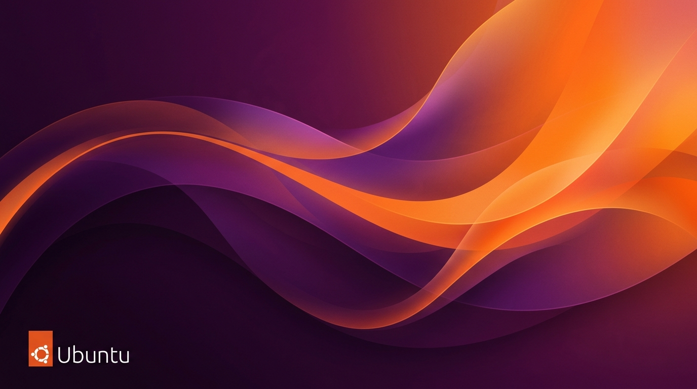

# Ubuntu-Like Website

A beautiful, interactive web experience designed to look and feel like an Ubuntu desktop operating system, built with Next.js and React.

## Features

- **Interactive Desktop Environment:** A fully functional top bar with a live clock, dynamic calendar dropdown, and status indicators.
- **Draggable Windows:** Open, close, and drag apps around the desktop just like a real OS!
- **Settings App:** Personalize your workspace by choosing between several beautiful pre-installed wallpapers.
- **macOS/Ubuntu Hybrid Aesthetic:** Designed to give a premium, polished feel combining the best of different desktop paradigms.
- **Responsive Dock:** Launch apps seamlessly from the floating dock at the bottom of the screen.

## Screenshots & Wallpapers

Here's a glimpse into the beautiful aesthetic and the various custom wallpapers included out of the box!

### Custom AI Edition Wallpaper


### Scenic Landscapes


## Getting Started

First, install the dependencies:
```bash
npm install
```

Then, run the development server:
```bash
npm run dev
```

Open your localhost at [http://localhost:3000](http://localhost:3000) to see the result.

## Tech Stack
- **Framework:** Next.js (App Router)
- **Library:** React 19
- **Icons:** Lucide React
- **Styling:** CSS
